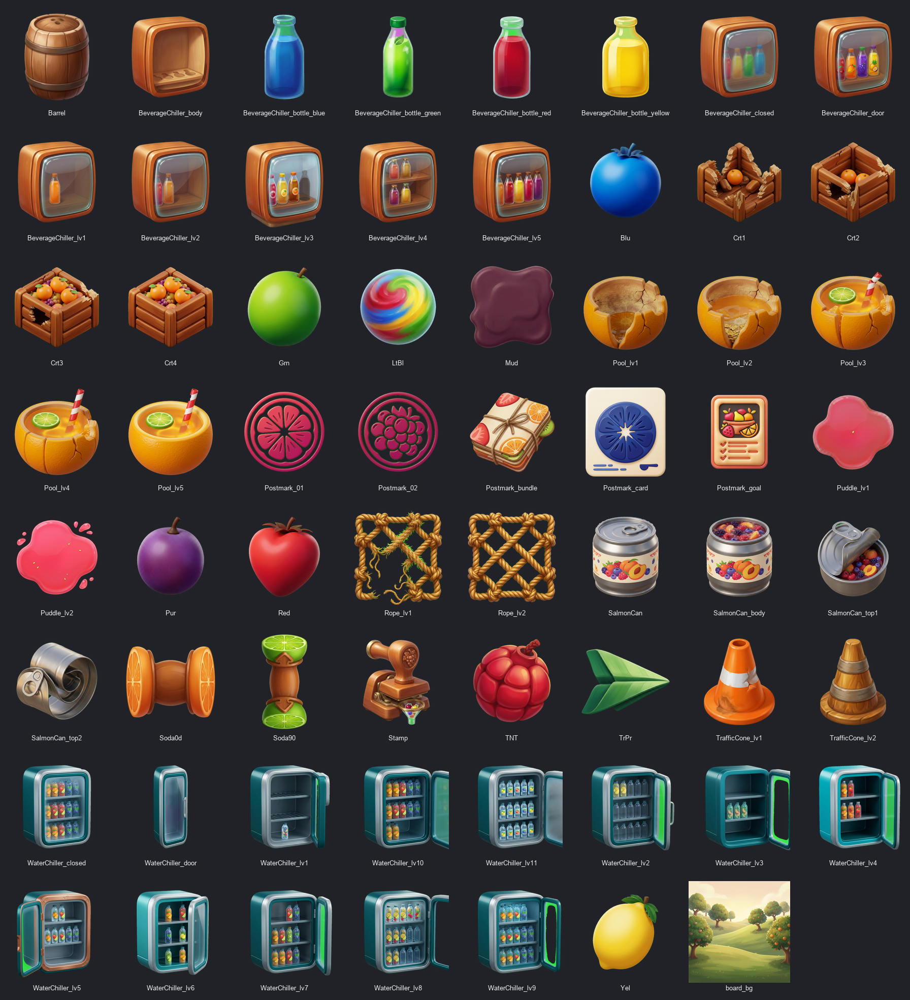
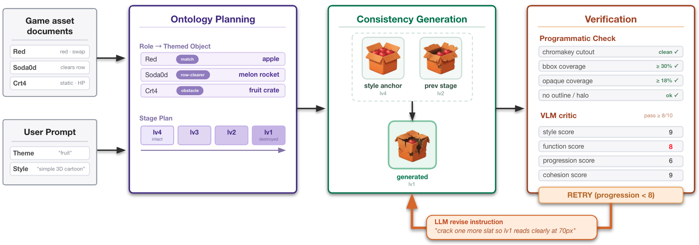
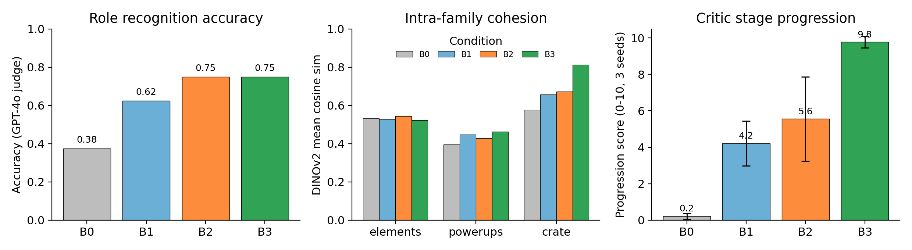
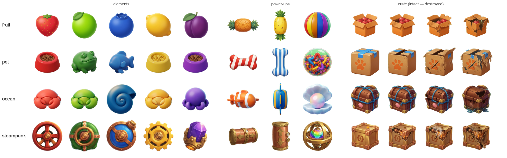

# Beyond Style Consistency: Gameplay-Consistent Generation of Game Asset Packs

**GAPGen** — a gameplay-aware asset pack generation system for Match-3 art, built on ontology
planning, consistency generation under dual visual references, and hybrid programmatic + VLM
verification.

> Ting-Kang Wang · Original Content Center, Gamania Inc., Taipei, Taiwan · `tim.tkwang@gmail.com`
>
> Submitted to the NeurIPS 2026 Creative AI Track. Paper source: [`paper/main.tex`](paper/main.tex).

<p align="center">
  
</p>

---

## Abstract

Existing multi-image generation methods primarily target **visual consistency**. Game asset
production additionally requires **gameplay consistency**: generated assets must preserve their
roles, affordances, and progression semantics while sharing a coherent visual style, and each
asset must stay readable at board scale and ship as an engine-ready cutout inside the pack.

Prior text-to-image and set-consistency methods optimize aesthetics, identity, or set-level style,
yet they do not treat gameplay function as a first-class constraint, and they do not check
acceptance inside a playable engine loop. We formalize **Gameplay-Consistent Asset Pack
Generation** and present **GAPGen**, which conditions generation on a gameplay ontology so that
families, affordances, and stage progression are enforced rather than left to chance, and whose
critic separates visual-style checks from gameplay-consistency checks.

In a Fruit-theme ablation over three seeds on twelve gameplay-critical assets, programmatic-only
stacks accept nearly all candidates in one pass, while adding the gameplay-consistency critic
spends more iterations and surfaces a variable `needs_review` fraction — showing that enforcing
gameplay consistency adds *targeted friction* rather than maximizing accept rate.

---

## Contributions

1. **A formulation** of gameplay-consistent asset pack generation, with layered success criteria
   that separate production readiness, visual consistency, and gameplay consistency.
2. **GAPGen**, a pipeline of ontology planning, consistency generation under dual references, and
   verification whose critic scores visual style and gameplay consistency on separate axes.
3. **A cross-model evaluation** that isolates critic self-preference by having one model judge
   another model's outputs, complemented by a model-independent cohesion signal; an ablation shows
   the critic redistributes friction rather than maximizing accept rate.

---

## The Task: Gameplay-Consistent Asset Pack Generation

The input is a gameplay asset ontology listing **families, role classes, and stage progressions**,
together with a style specification and an optional theme concept. Given a target subset of assets,
the task is to produce a pack of engine-ready sprites plus an auditable trace of the plans,
prompts, critiques, and scores behind each one.

A pack is judged on three layers:

| Layer | What it checks | Who checks |
|---|---|---|
| **Production readiness** | Clean cutout, coverage, illegal-outline / face checks | Automatic |
| **Visual consistency** | Global style and intra-family cohesion | Automatic |
| **Gameplay consistency** | Role/affordance recognition at board scale, correct stage progression | Human (final say) |

---

## Method: GAPGen

<p align="center">
  
</p>

GAPGen runs three core stages with a revise-and-retry loop:

- **Ontology planning.** A style planner locks the free-form style prompt into a rendering spec; a
  theme planner maps each role to a themed object (e.g. a match element → an apple, a row-clearer →
  a melon rocket) so role and affordance stay fixed while appearance changes; a stage planner
  produces an ordered stage plan and reference chain from intact anchor to destroyed stage.
- **Consistency generation with dual references.** Each prompt is conditioned on the ontology
  (role class, preserve/avoid constraints, family cohesion). A later asset attaches a **style-anchor
  image** to lock rendering language and a **previous-stage image** to lock progression direction —
  separating the two failure modes (style drift vs. progression collapse) that a single reference
  entangles.
- **Verification.** A deterministic programmatic check (chromakey cutout, bbox/opaque coverage,
  outline/halo test) runs first; a VLM critic then scores four axes — **style** and **cohesion**
  (visual consistency), **function** and **progression** (gameplay consistency) — on a checkerboard
  composite. Any axis below threshold triggers a revise instruction and regeneration up to *N*
  iterations; otherwise the best candidate is kept and marked `needs_review`.

---

## Results

### Ablation (Fruit × 3D-cartoon-simple, mean ± std over 3 seeds)

A higher pass rate is **not** better — without the critic, B0–B2 only check cutout/coverage and
accept nearly every tile. B3 spends more iterations and flags a variable `needs_review` fraction,
surfacing friction exactly where soft production checks would have shipped every tile.

| Condition | Pass@*N* | Needs review | Mean iters | Coh., Prog. ↑ |
|---|---|---|---|---|
| B0 Naive    | 1.00 ± 0.00 | 0.00 | 1.00 | 3.74, 0.22 |
| B1 Ontology | 0.97 ± 0.04 | 0.00 | 1.00 | 3.58, 4.22 |
| B2 + Refs   | 0.97 ± 0.04 | 0.00 | 1.00 | 4.35, 5.56 |
| **B3 Full** | 0.89 ± 0.10 | 0.11 ± 0.10 | 1.95 ± 0.34 | **9.04, 9.78** |

### Cross-model proxy evaluation (judge: GPT-4o; generator: Gemini)

| Metric | B0 | B1 | B2 | B3 |
|---|---|---|---|---|
| Role accuracy @70px ↑    | 0.38 | 0.63 | 0.75 | 0.75 |
| Pairwise win rate vs. B1 ↑ | 0.50 | — | 1.00 | 1.00 |
| DINOv2 crate cohesion ↑  | 0.58 | 0.66 | 0.67 | **0.81** |

<p align="center">
  
</p>

### Qualitative: one ontology, four themes

<p align="center">
  
</p>

Each row is one theme, split into match elements, power-ups, and a crate obstacle across its four
depletion stages (intact → destroyed). One ontology and pipeline produce role-consistent,
stage-consistent packs regardless of theme.

---

## Repository Layout

```
Match3_sim/
├── README.md              # This file — the GAPGen paper
├── paper/                 # Paper source (main.tex, refs.bib, figures/, results/)
├── art_pipeline/          # GAPGen core: planner / generation / critic
├── scripts/               # Generation + evaluation CLIs (ai_art_gen, auto_eval, research_*)
├── godot_demo/            # Match-3 demo game system (see godot_demo/README.md)
├── web_game/              # Web port of the Match-3 demo (see web_game/README.md)
├── serve_web.sh           # Start/stop local server + Cloudflare tunnel for web_game
└── generated_art/         # Generated outputs (gitignored)
```

The playable Match-3 demo system (level generator, simulator, AI auto-test) has its own docs in
**[`godot_demo/README.md`](godot_demo/README.md)**.

---

## Citation

```bibtex
@inproceedings{wang2026gapgen,
  title     = {Beyond Style Consistency: Gameplay-Consistent Generation of Game Asset Packs},
  author    = {Wang, Ting-Kang},
  booktitle = {NeurIPS 2026 Creative AI Track},
  year      = {2026}
}
```
